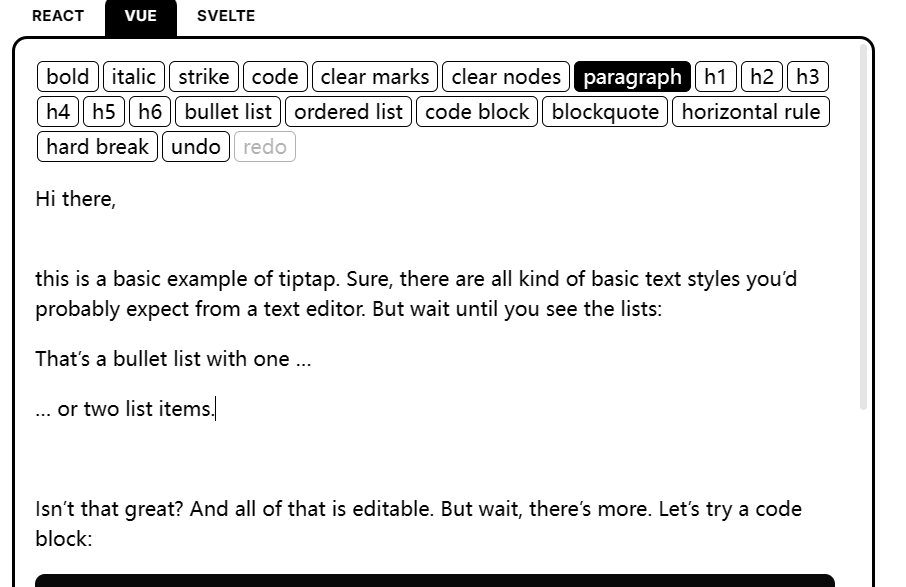
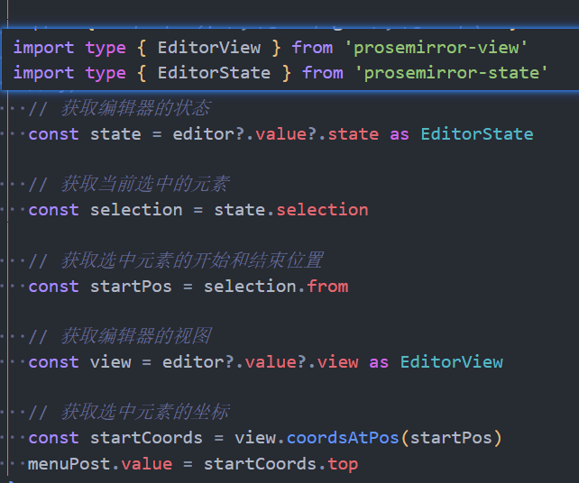
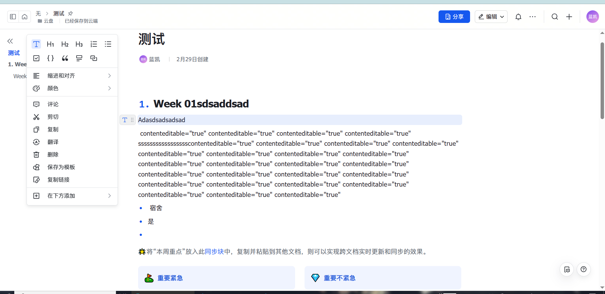
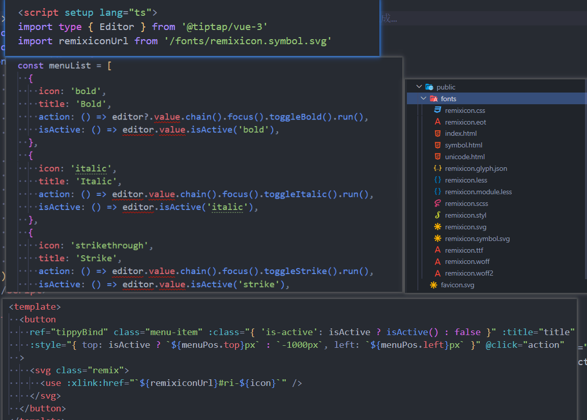

## 使用 tiptap 创建一个富文本编辑器

## 安装

## API

### Editor

编辑器就是像 wps 那样写东西的一个区域，tiptap 提供了一个 Editor 类，用于创建一个编辑器实例。
编辑器实例将提供一堆公共方法。方法是常规函数，可以返回任何内容。他们将帮助您使用编辑器。

Don’t confuse methods with commands. Commands are used to change the state of editor (content, selection, and so on) and only return true or false.
不要将方法与命令混淆。命令用于更改编辑器的状态（内容、选择等），并且仅返回 true 或 false 。

### 官方示例的初始编辑器及其用法解释

https://tiptap.dev/docs/editor/examples/default



- 这里很多都不用说，在这里解释一下这个 hardBreak 是什么意思，这个 hardBreak 是一个 node，它是一个换行符
- 然后 clear nodes 表示清除所有节点，像无序列表，有序列表那些前缀都是我们插入的 node，我们可以通过这个方法清除所有的 node
- horizonal role 是一个分割线，这个也是一个 node

代码如下：

```js
<script setup lang="ts">
import StarterKit from '@tiptap/starter-kit'
import { EditorContent, useEditor } from '@tiptap/vue-3'

const editor = useEditor({
  content: '<p>Hello, World!</p>',
  extensions: [
    StarterKit,
  ],
  editable: true, // 是否可编辑
  autofocus: true, // 自动聚焦 就是页面开始时光标会在编辑器中 start在开头 end在结尾  all 选择整个文档
  // 输入规则

})
onUnmounted(() => {
  editor.value?.destroy()
})
</script>

<template>
  <div v-if="editor">
    <button
      :disabled="!editor.can().chain().focus().toggleBold().run()" :class="{ 'is-active': editor.isActive('bold') }"
      @click="editor.chain().focus().toggleBold().run()"
    >
      bold
    </button>
    <button
      :disabled="!editor.can().chain().focus().toggleItalic().run()"
      :class="{ 'is-active': editor.isActive('italic') }" @click="editor.chain().focus().toggleItalic().run()"
    >
      italic
    </button>
    <button
      :disabled="!editor.can().chain().focus().toggleStrike().run()"
      :class="{ 'is-active': editor.isActive('strike') }" @click="editor.chain().focus().toggleStrike().run()"
    >
      strike
    </button>
    <button
      :disabled="!editor.can().chain().focus().toggleCode().run()" :class="{ 'is-active': editor.isActive('code') }"
      @click="editor.chain().focus().toggleCode().run()"
    >
      code
    </button>
    <button @click="editor.chain().focus().unsetAllMarks().run()">
      clear marks
    </button>
    <button @click="editor.chain().focus().clearNodes().run()">
      clear nodes
    </button>
    <button :class="{ 'is-active': editor.isActive('paragraph') }" @click="editor.chain().focus().setParagraph().run()">
      paragraph
    </button>
    <button
      :class="{ 'is-active': editor.isActive('heading', { level: 1 }) }"
      @click="editor.chain().focus().toggleHeading({ level: 1 }).run()"
    >
      h1
    </button>
    <button
      :class="{ 'is-active': editor.isActive('heading', { level: 2 }) }"
      @click="editor.chain().focus().toggleHeading({ level: 2 }).run()"
    >
      h2
    </button>
    <button
      :class="{ 'is-active': editor.isActive('heading', { level: 3 }) }"
      @click="editor.chain().focus().toggleHeading({ level: 3 }).run()"
    >
      h3
    </button>
    <button
      :class="{ 'is-active': editor.isActive('heading', { level: 4 }) }"
      @click="editor.chain().focus().toggleHeading({ level: 4 }).run()"
    >
      h4
    </button>
    <button
      :class="{ 'is-active': editor.isActive('heading', { level: 5 }) }"
      @click="editor.chain().focus().toggleHeading({ level: 5 }).run()"
    >
      h5
    </button>
    <button
      :class="{ 'is-active': editor.isActive('heading', { level: 6 }) }"
      @click="editor.chain().focus().toggleHeading({ level: 6 }).run()"
    >
      h6
    </button>
    <button
      :class="{ 'is-active': editor.isActive('bulletList') }"
      @click="editor.chain().focus().toggleBulletList().run()"
    >
      bullet list
    </button>
    <button
      :class="{ 'is-active': editor.isActive('orderedList') }"
      @click="editor.chain().focus().toggleOrderedList().run()"
    >
      ordered list
    </button>
    <button
      :class="{ 'is-active': editor.isActive('codeBlock') }"
      @click="editor.chain().focus().toggleCodeBlock().run()"
    >
      code block
    </button>
    <button
      :class="{ 'is-active': editor.isActive('blockquote') }"
      @click="editor.chain().focus().toggleBlockquote().run()"
    >
      blockquote
    </button>
    <button @click="editor.chain().focus().setHorizontalRule().run()">
      horizontal rule
    </button>
    <button @click="editor.chain().focus().setHardBreak().run()">
      hard break
    </button>
    <button :disabled="!editor.can().chain().focus().undo().run()" @click="editor.chain().focus().undo().run()">
      undo
    </button>
    <button :disabled="!editor.can().chain().focus().redo().run()" @click="editor.chain().focus().redo().run()">
      redo
    </button>
  </div>
  <EditorContent :editor="editor" class="border-3 outline-none" />
</template>

<style scoped lang="scss">
/* Basic editor styles */
button {
  margin: 0 0.5rem;
  padding: 0.5rem 1rem;
  border: 1px solid #ccc;
  border-radius: 0.25rem;
  background: #fff;
  cursor: pointer;
  transition: all 0.2s;

  &:hover {
    background: #f5f5f5;
  }

  &.is-active {
    background: #f5f5f5;
  }
}

.tiptap {
  > * + * {
    margin-top: 0.75em;
  }

  ul,
  ol {
    padding: 0 1rem;
  }

  h1,
  h2,
  h3,
  h4,
  h5,
  h6 {
    line-height: 1.1;
  }

  code {
    background-color: rgba(#616161, 0.1);
    color: #616161;
  }

  pre {
    background: #0d0d0d;
    color: #fff;
    font-family: 'JetBrainsMono', monospace;
    padding: 0.75rem 1rem;
    border-radius: 0.5rem;

    code {
      color: inherit;
      padding: 0;
      background: none;
      font-size: 0.8rem;
    }
  }

  img {
    max-width: 100%;
    height: auto;
  }

  blockquote {
    padding-left: 1rem;
    border-left: 2px solid rgba(#0d0d0d, 0.1);
  }

  hr {
    border: none;
    border-top: 2px solid rgba(#0d0d0d, 0.1);
    margin: 2rem 0;
  }
}
</style>

```

### Editor 的方法

这个方法是编辑器本身的，比如说，获取焦点，设置节点，判断是否聚焦，获取 html 等

### 针对这个 Tiptap 学习的一些总结

首先是，必用的插件先码出来

#### 如何获取编辑器中的节点/状态

编辑器内部都是节点，我们想要通过一些方式来获取这些节点，然后我们就可以根据这些节点来进行一些操作，比如说我想要拿到 node，然后进行 dom 操作，获取每一行的相对高度

这里我翻了很久的文档，其实关键点在于 tiptap 是基于 prosemirror 的，所以我们可以直接使用 prosemirror 的方法来获取编辑器的状态，这些是我在 copilot 里面得到的，感恩
这里提一嘴这个傻逼 from 和 to 不知道是什么东西，每次得到的结果都是这俩坐标相同


```js
    const state = editor?.value?.state as EditorState
    console.log('$doc', editor.value.$doc)
    console.log('$node', editor.value.$node)
    console.log('$nodes', editor.value.$nodes)
    console.log('pos', editor.value.$pos)
    console.log('view', editor.value.view)
    console.log('state', editor.value.state)
```

我们先把这些编辑器的状态打印出来康康，主要是这个 view，view 里面我们可以看到有 dom，意味着我们可以进行 dom 操作,然后我们就可以通过这个 coordsAtPost 获取每一行坐标，这个的作用类似于 dom 的 getBoundingClientRect


## 项目要做的功能日志记录

### 富文本编辑器

#### 鼠标点击每一行时显示浮动菜单

想要的效果是类似飞书那样的，鼠标浮动到每一行就会显示一个菜单，然后出现可以操作文本的按钮，比如加粗，H1 等

好我们提出几个问题

- 怎么获取 dom 节点，上面已经提到了不谈
- 图标库怎么获得，怎么引入图标
- 浮动菜单怎么实现
- 如何让这些功能图标跟随着每一行的高度变化而出现在每一行的左边

让我们一个个解决

- 图标库的话这里是使用了 remixIcon，本来想用 uno 的，但是 uno 的图标库里没有 editor 的图标
  https://github.com/Remix-Design/RemixIcon/blob/master/README_CN.md 官方文档有讲如何使用
  在这里我是借用了官方的示例，下载了 remixicon.symbol.svg,放在 public 文件夹下的 fonts 里，然后引入，再像 tiptap 官方示例那样，通过一个 menu 数组来赋值



- 浮动菜单怎么实现
  官方的 floatMenu 不好用，然后我看到了拓展里有提到源码是使用的 tippy.js

#### 可使用 markdown 语法

#### 插入图片等各种插件

#### 多人协作编辑 ！important

#### 保存编辑器状态
