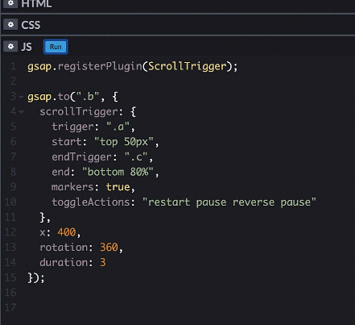
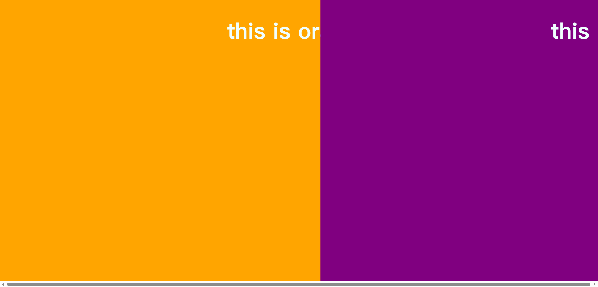
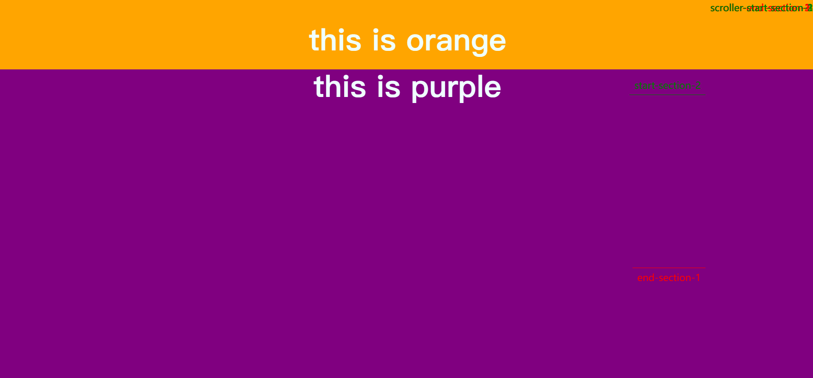

## gsap的使用

### 基础知识
非常好，我将同时扮演GSAP教程作者和GSAP问题解答专家的角色来帮助您了解GSAP的常见用法和方法。

GSAP是一个强大的JavaScript动画库，用于创建流畅、高性能的Web动画。以下是GSAP的一些常见用法和方法的解释：

1. TweenMax.to()：这是GSAP中最常用的方法之一，用于创建动画效果。它接受目标元素和动画选项作为参数，并在指定的持续时间内对元素应用动画效果。例如：

```javascript
TweenMax.to(".element", 1, { opacity: 0, x: 100 });
```

上述代码将选择类名为"element"的元素，并在1秒钟内将其透明度设置为0，同时沿X轴移动100个像素。

2. TweenMax.from()：这个方法与TweenMax.to()类似，但是它会将动画效果从指定的初始状态应用到目标状态。例如：

```javascript
TweenMax.from(".element", 1, { opacity: 0, x: -100 });
```

上述代码将选择类名为"element"的元素，并从透明度为0、沿X轴偏移-100个像素的状态开始动画效果。

3. TweenMax.staggerTo()：这个方法允许您对一组元素应用类似的动画效果，但是每个元素之间具有一定的延迟。例如：

```javascript
TweenMax.staggerTo(".element", 0.5, { opacity: 0, y: 50 }, 0.2);
```

上述代码将选择类名为"element"的一组元素，并在0.5秒内将它们的透明度设置为0，同时沿Y轴移动50个像素。每个元素之间的动画延迟为0.2秒。

4. TweenMax.set()：这个方法用于设置元素的初始状态，而不是应用动画效果。它接受目标元素和属性对象作为参数，并立即将属性值应用于元素。例如：

```javascript
TweenMax.set(".element", { opacity: 0, scale: 0 });
```

上述代码将选择类名为"element"的元素，并将它们的透明度设置为0，同时将它们的缩放比例设置为0。

这些只是GSAP的一些常见用法和方法的示例。GSAP还提供了许多其他功能，如时间轴控制、缓动函数、路径动画等。如果您对特定的用法或方法有更多的问题，请随时提问，我将很乐意为您解答。

### 在vue中使用gsap

### scrollTrigger

#### test1
最简单的demo实践


#### test2 试着练习一下和ppt一样的效果

code:
```vue  
<!--
 * new page
 * @author: blue
 * @since: 2023-12-12
 * testgasp.vue
-->
<script setup lang="ts">
import { onMounted, ref } from 'vue'
import { gsap } from "gsap"
import { ScrollTrigger } from "gsap/ScrollTrigger";
gsap.registerPlugin(ScrollTrigger);
gsap.defaults({
    ease: "none",
    duration: 2
});
const boxa = ref<HTMLElement | null>(null)
const boxc = ref<HTMLElement | null>(null)
const boxb = ref<HTMLElement | null>(null)
onMounted(() => {

    // 类似ppt的一个动画，左右上，from表示延迟触发
    const tl = gsap.timeline();
    tl.from(boxa.value, { xPercent: -100 })
        .from(boxb.value, { xPercent: 100 })
        .from(boxc.value, { yPercent: -100 });

    ScrollTrigger.create({
        animation: tl,
        trigger: ".container",
        start: "top top",
        end: "+=1000",
        scrub: true,
        pin: true,

    })
})


</script>
<template>
    <div class="container">
        <section class="orange" ref="boxa">
            <h1>this is orange</h1>
        </section>
        <section class="purple" ref="boxb">
            <h1>this is purple</h1>
        </section>
        <section class="green" ref="boxc">
            <h1>this is green</h1>
        </section>
    </div>
</template>


<style scoped lang="scss">
.container {
    width: 100%;
    height: 3000px;
    color: azure;
    text-align: center;
    justify-content: center;
    align-items: center;

    .orange {
        height: 100vh;
        width: 100%;
        background-color: orange;
        position: absolute;
    }

    .purple {
        height: 100vh;
        width: 100%;
        background-color: purple;
        position: absolute;
    }

    .green {
        height: 100vh;
        width: 100%;
        background-color: green;
        position: absolute;
    }
}
</style>
```


#### test3 经典之视差滚动



```vue  
<!--
 * new page
 * @author: blue
 * @since: 2023-12-12
 * testgasp.vue
-->
<script setup lang="ts">
import { onMounted, ref } from 'vue'
import { gsap } from "gsap"
import { ScrollTrigger } from "gsap/ScrollTrigger";
gsap.registerPlugin(ScrollTrigger);
gsap.defaults({
    ease: "none",
    duration: 2
});
const boxa = ref<HTMLElement | null>(null)
const boxc = ref<HTMLElement | null>(null)
const boxb = ref<HTMLElement | null>(null)
onMounted(() => {

    // 
    gsap.utils.toArray(".container > section").forEach((section, i) => {
        ScrollTrigger.create({
            trigger: section as HTMLElement,
            start: "top top",
            end: "+=1000",
            scrub: 0.5,
            pin: true,
            pinSpacing: false,
            markers: true,
            id: `section-${i + 1}`,
            toggleClass: "active",
            invalidateOnRefresh: true
        });
    });
})


</script>
<template>
    <div class="container">


        <section class="orange" ref="boxa">
            <h1>this is orange</h1>
        </section>
        <section class="purple" ref="boxb">
            <h1>this is purple</h1>
        </section>
        <section class="green" ref="boxc">
            <h1>this is green</h1>
        </section>
    </div>
</template>


<style scoped lang="scss">
.container {
    width: 100%;
    height: 3000px;
    color: azure;
    text-align: center;
    justify-content: center;
    align-items: center;

    .orange {
        height: 100vh;
        width: 100%;
        background-color: orange;
        // position: absolute;
        // z-index: 0;
    }

    .purple {
        height: 100vh;
        width: 100%;
        background-color: purple;
        // position: absolute;
        // z-index: 1;
    }

    .green {
        height: 100vh;
        width: 100%;
        background-color: green;
        // position: absolute;


}
</style>

```