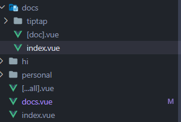

## 先思考

看到路由，无非是想到 3 个问题

1. 基础路由怎么配置
2. 动态路由/路由嵌套怎么做
3. 路由鉴权怎么做

https://juejin.cn/post/7245165497632964666

## unpluginRouter 文件路由

### 配置多级子路由的方法

先讲讲这沟槽的文件路由，如果想像以前那样，/management/xxx 那这样的配置方法是这样的
假设我们需要以下文件结构，需要将路由渲染到/docs/\*下

```js
--- docs
------ xxx
------ xxx
--- index
```

那我们就需要这样子来设置


需要配置一个与文件夹同名的 xxx.vue，这样会表明这个目录下有子路由，然后这个 docs.vue 就变成 layout，路由的出口

```js
<script setup lang="ts" generic="T extends any, O extends any">
import asides from '~/layouts/asides.vue'
import mains from '~/layouts/mains.vue'
import headers from '~/layouts/headers.vue'

defineOptions({
  name: 'Docs',
})
</script>

<template>
  <el-container min-h="100vh">
    <asides />
    <el-container>
      <el-header>
        <headers />
      </el-header>
      <el-main><mains /></el-main>
    </el-container>
  </el-container>
</template>
```

我们将 main 作为出口就行

```js
<!--
 * new page
 * @author: blue
 * @since: 2024-03-17
 * main.vue
-->
<script setup lang="ts"></script>

<template>
  <div class="container">
    <router-view v-slot="{ Component }">
      <transition name="fade">
        <!-- 渲染layout一级路由的子路由 -->
        <component :is="Component" />
      </transition>
    </router-view>
  </div>
</template>

<style scoped></style>

```


这样这里就是 docsindex 的出口

然后后续的路由就按照子路由那样配置就好了
比如说docs/tiptap 就放一个tiptap目录