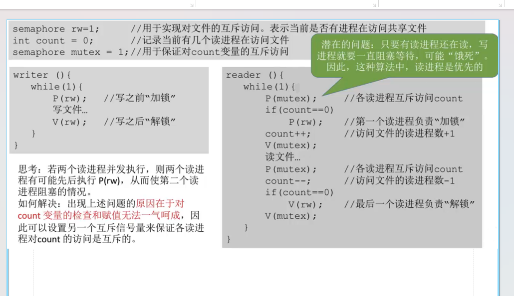
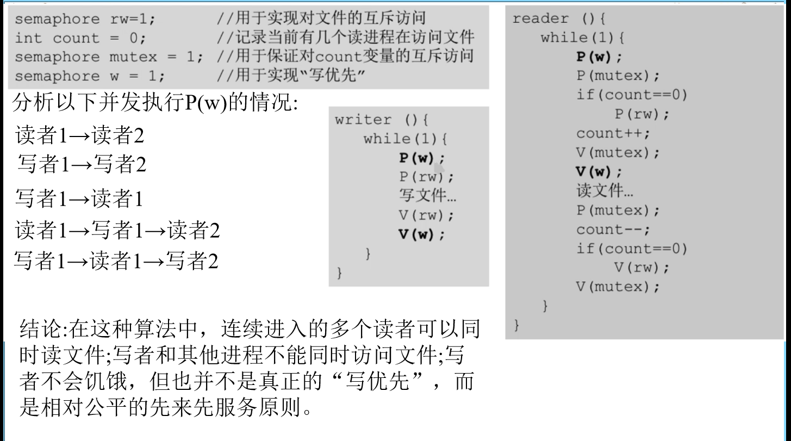

## 读者和写者
读的时候不能写，写的时候不能读，读和写直接是互斥的，但是读和读之间没有互斥关系，写和写有互斥关系，只能同时存在一个写者

## 读者写者问题的解决方案

第一种是读优先

先看读者，第一个读者开读，然后互斥信号量--，这个互斥是为了让count的+能保证互斥，不然如果同时两个读者并发执行的话，有可能count的值会同时+1，这样就会导致读到错误的数据，所以要加一个互斥信号量，然后count++
然后第一个读者加完了以后就vmutex，加回去，然后下一个读者继续能读
写者这里就比较简单，有锁就不能写，写完才能解锁，这里的写者是互斥的，所以写者之间是不能并发的，只能一个一个的来

第二种是写优先

读者1到读者2
第一个读者进去，pw能行，pmutex能行，完了+了以后，上锁了，锁完不能写了，然后继续，后面都能执行

然后写者1到写者2也没啥好说的，写完才能写

写完才能读

然后读写度的话
第一个读者开读，然后就上锁了，上完锁以后，读者读完就能写